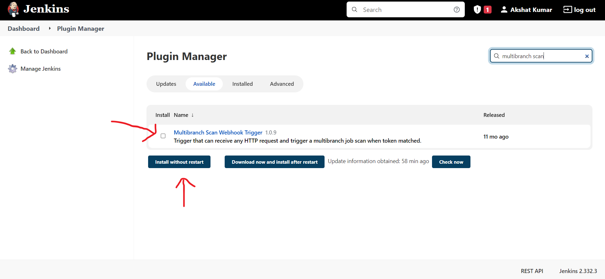
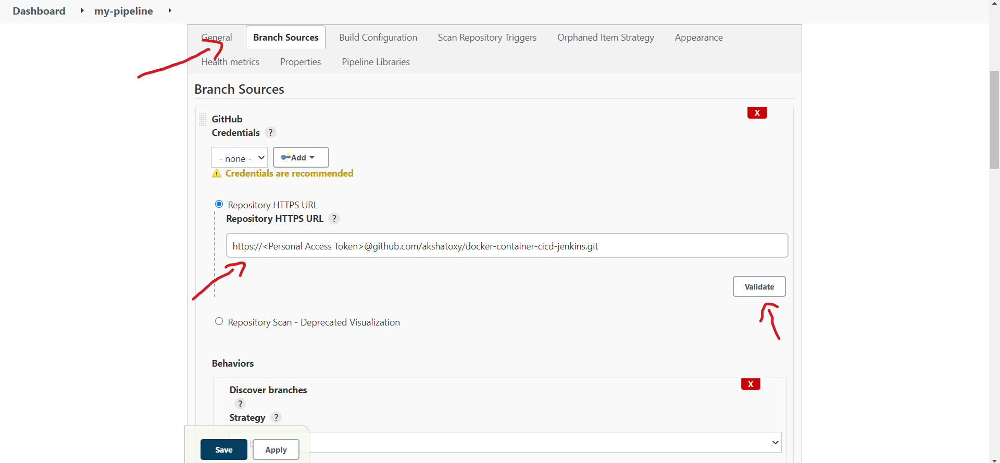
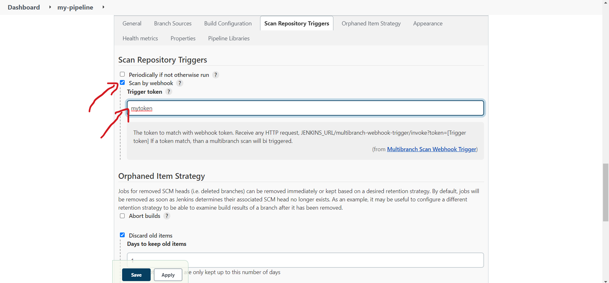
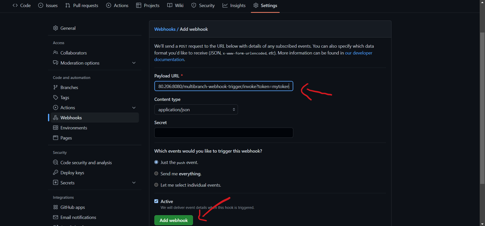
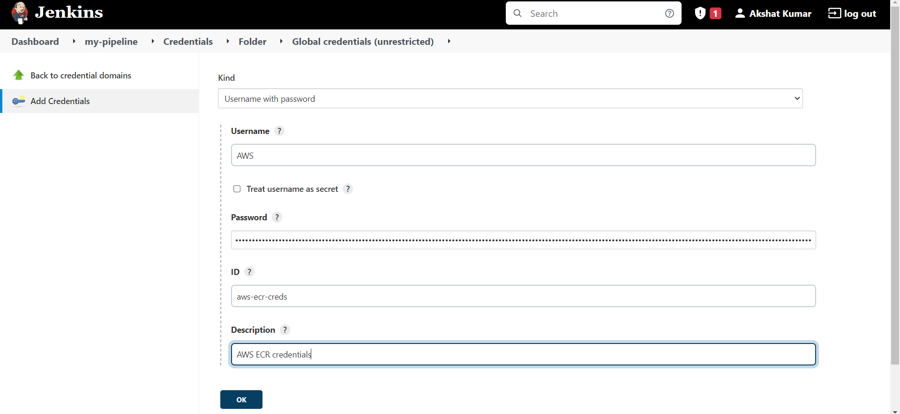

# Node application
 
- Create a Dockerfile to build a Docker image of the node application.
- Create a Docker Compose file to create 3 containers for node app, mongodb and mongo express.
- Create a Jenkins pipeline to automate building image, pushing the image to `ECR` and deploying to `EC2`.

## 1. Create a Dockerfile

- Create a file with name `Dockerfile` in your root folder.

- Add following commands to your `Dockerfile`:

```Dockerfile
FROM node:18-alpine

ENV MONGO_DB_USERNAME=admin \
    MONGO_DB_PWD=password

RUN mkdir -p /home/app

COPY . /home/app

WORKDIR /home/app

RUN npm install

CMD ["node", "server.js"]
```

## 2. Create a docker-compose.yaml file

- Create a file with name `docker-compose.yaml` in your root folder.

- Add following configuration to your `docker-compose.yaml`:

```yaml
version: '3'
services:
  my-app:
    image: myapp:latest
    container_name: my-app
    ports:
     - 3000:3000
  mongodb:
    image: mongo
    container_name: mongodb
    ports:
     - 27017:27017
    environment:
     - MONGO_INITDB_ROOT_USERNAME=admin
     - MONGO_INITDB_ROOT_PASSWORD=password
    volumes:
     - mongo-data:/data/db
  mongo-express:
    image: mongo-express
    container_name: mongo-express
    restart: always
    ports:
     - 8080:8081
    environment:
     - ME_CONFIG_MONGODB_ADMINUSERNAME=admin
     - ME_CONFIG_MONGODB_ADMINPASSWORD=password
     - ME_CONFIG_MONGODB_SERVER=mongodb
    depends_on:
     - "mongodb"
volumes:
  mongo-data:
    driver: local
```

## 3. Create a Jenkins pipeline automate build, push and deploy

- Create an `EC2` instance on `AWS` with a key-pair. 

- Install `Docker` on the `EC2` instance.

```bash
sudo yum update -y # Update the packages
sudo amazon-linux-extras install docker # Install docker
sudo service docker start # Start docker
sudo systemctl enable docker # Start docker automatically after restart
sudo usermod -a -G docker ec2-user # Add ec2-user to docker group
```

- Restart your terminal to use `Docker` commands without `sudo`.

- Run a `Jenkins` container using `Docker`.

```bash
docker run -d -p 8080:8080 -p 50000:50000 -v jenkins_home:/var/jenkins_home -v /var/run/docker.sock:/var/run/docker.sock -v $(which docker):/usr/bin/docker jenkins/jenkins:lts
sudo usermod -a -G docker jenkins
```

- Now, go to `http://<public-ip-of-ec2>:8080`. You will need to unlock `Jenkins`

- `SSH` into your `EC2` and go inside the container and copy the contents of the file mentioned in `Jenkins` and paste.

```bash
docker exec -it <jenkins-container-id> sh # To run a terminal inside your container
cat /var/jenkins_home/secrets/initialAdminPassword
```

- Configure `Jenkins`. Go to my [spring-boot-app-cicd-jenkins](https://github.com/akshatoxy/spring-boot-app-cicd-jenkins) repo to see a guide.

- Go to `Manage Jenkins` then `Manage Plugins`, click on `Available` and search for `Multibranch Scan Webhook Trigger` and `SSH Agent`. Install it and restart.



- After restarting `SSH` into your `EC2` and run `docker start <jenkins-container-id>` to start `Jenkins` again.

- Create a `MutltiBranch Pipeline`. Click on Branch Sources then add sources and select Github. Add the credentials if your repository is private else add the Url and click Validate.



- After that click on `Scan Multibranch Pipeline Triggers` and select `Scan by webhook`. Add a token and click `Apply` and `Save`.



- Go to your GitHub repo, click on Settings then scroll down and click on Webhooks. Add a webhook add `http://<public-ip-of-ec2>:8080/multibranch-webhook-trigger/invoke?token=<token>` then select `application/json` as content type and click add webhook.




- After that go to `AWS` and create a private repository. Then go to your `aws cli` and run `aws ecr get-login-password --region <your-region>` and copy the password.

- Add the `ECR` credential to your `Jenkins` server with the username `AWS` and the paste the password in the password section.



- Create another `EC2` instance with a key-pair to host our node app and install docker and docker-compose.

```bash
sudo curl -L "https://github.com/docker/compose/releases/download/1.24.1/docker-compose-$(uname -s)-$(uname -m)" -o /usr/local/bin/docker-compose # Download docker-compose
sudo chmod +x /usr/local/bin/docker-compose # Change permissions
docker–compose –-version # Verify installation
```

- Create an IAM role with `AmazonEC2ConatinerRegistryReadOnly` policy and attach it to your `EC2`.

- `SSH` into your node app `EC2` and run `aws ecr get-login-password --region <region> | docker login --username AWS --password-stdin <repo-server>`.

- Add the node app key-pair to `Jenkins` credential.

- Add `script.groovy` in your root directory.

```groovy
def buildImage() {
    echo "Building the docker image..."
    sh "docker build -t 639504421228.dkr.ecr.us-east-1.amazonaws.com/docker-container-cicd-jenkins:latest ."
}

def pushToECR() {
    withCredentials([usernamePassword(credentialsId: 'aws-ecr-creds', passwordVariable: 'PASS', usernameVariable: 'USER')]) {
        sh "echo $PASS | docker login -u $USER --password-stdin 639504421228.dkr.ecr.us-east-1.amazonaws.com"
        sh "docker push 639504421228.dkr.ecr.us-east-1.amazonaws.com/docker-container-cicd-jenkins:latest"
    }
}

def deployToEC2() {
    def ec2Instance = "ec2-user@54.159.173.159"

    sshagent(['ec2-server-key']) {
        sh "scp -o StrictHostKeyChecking=no server-cmds.sh ${ec2Instance}:/home/ec2-user"
        sh "scp -o StrictHostKeyChecking=no docker-compose.yaml ${ec2Instance}:/home/ec2-user"
        sh "ssh -o StrictHostKeyChecking=no ${ec2Instance} bash ./server-cmds.sh"
    }
}

return this
```

- Add `server-cmds.sh` in your root directory.

```bash
#!/usr/bin/env bash

docker-compose -f /home/ec2-user/docker-compose.yaml up --detach
echo "Success"
```

- Update your `Jenkinsfile`.

```Jenkinsfile
pipeline {
  agent any
  stages {

    stage("init") {
      steps {
        script {
          gv = load "script.groovy"
        }
      }
    }

    stage("buildImage") {
      steps {
        script {
          gv.buildImage()
        }
      }
    }
    
    stage("pushToECR") {
      steps {
        script {
          gv.pushToECR()
        }
      }
    }

    stage("deployToEC2") {
      steps {
        script {
          gv.deployToEC2()
        }
      }
    }
  }
}
```

- Push the changes to your GitHub repository.

- Now you can access your application on `http://<node-app-public-ip>:3000` and mongo express on `http://<node-app-public-ip>:8080`.